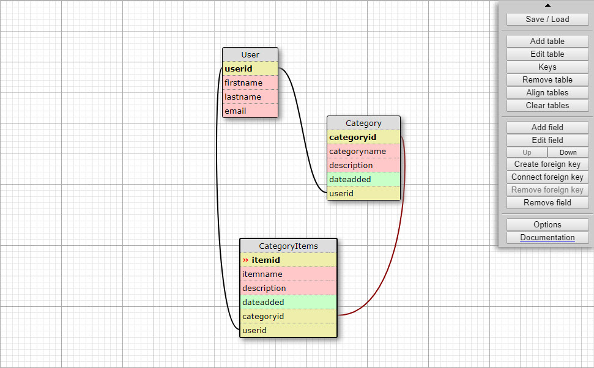
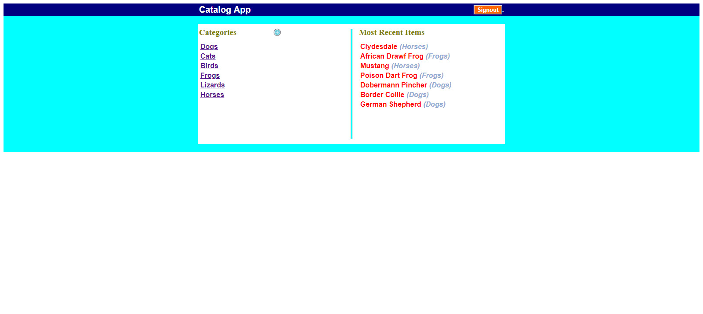
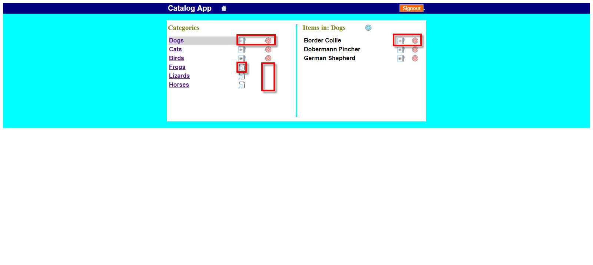
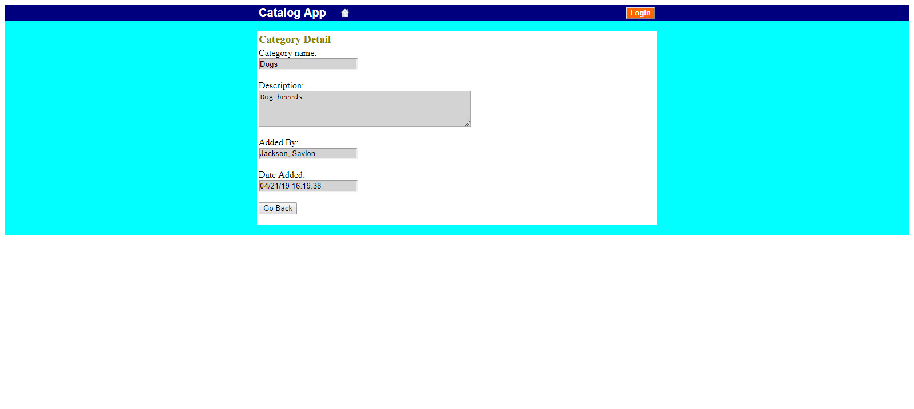
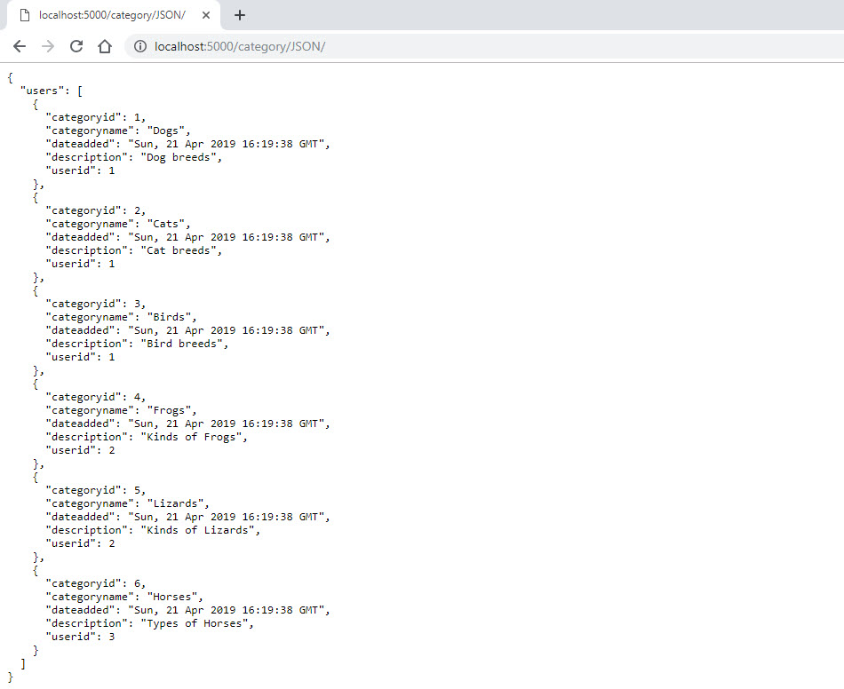
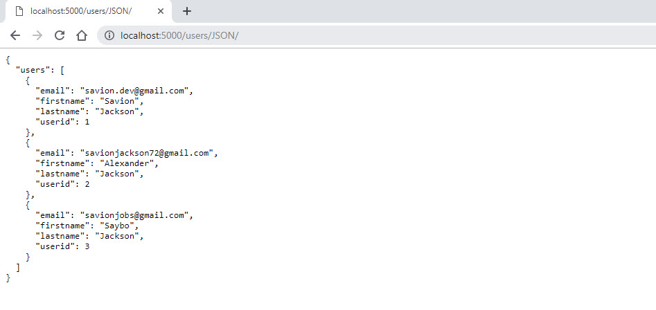
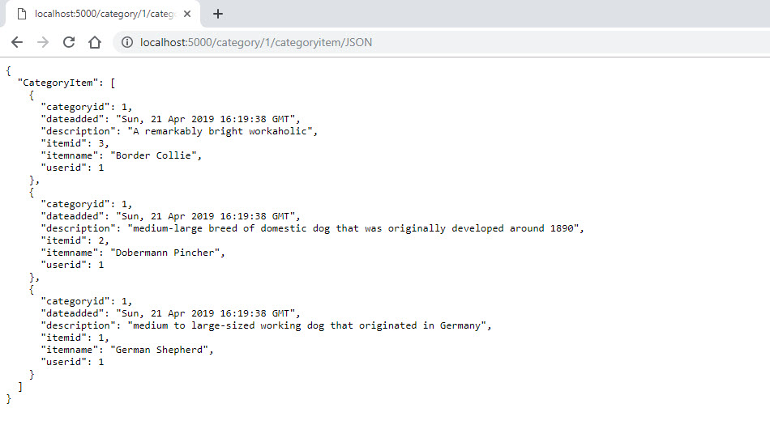

# Item Catelog 

## Project Overview
Develop an application that provides a list of items within a variety of categories as well as provide a user registration and authentication system. Registered users will have the ability to post, edit and delete their own items.

## Why This Project?
Modern web applications perform a variety of functions and provide amazing features and utilities to their users; but deep down, it’s really all just creating, reading, updating and deleting data. In this project, you’ll combine your knowledge of building dynamic websites with persistent data storage to create a web application that provides a compelling service to your users.

## What I Learned?
- How to develop a Restful web application using the Python framework Flask along with implementing third-party OAuth authentication. 
- CRUD (create, read, update and delete) operations.

# Prerequisites

 > Python
 
## Built With 
>[Flask Microframewrok](http://flask.pocoo.org/)

>[PostgreSql](https://www.postgresql.org/)

>[OAuth](https://oauth.net/code/python/)

### Installing
##### Flask: 
pip install Flask

##### PostgreSQL
[Download PostgreSQL installer](http://www.postgresqltutorial.com/install-postgresql/)

# Development

## Issues
Facebook Login: [Privacy Policy](https://www.termsfeed.com/blog/privacy-policy-url-facebook-app/
) is required for all Facebook apps before the app is authorized to appear live (in production). Too problematic to build a live app using FB for a class project, because you need actual verifiable URLs that are not in localhost.  FB apps in the Dev/Test environment support localhost but require that all developers/testers have access granted in advance of accessing the app.  Because of this, it's not possible to provide reviewers access in advance to test/validate the project.  Therefore I have opted only to provide OAuth authentication using Google, which provides an easier path to production with fewer restrictions.

OAuth: The method of OAuth authentication in this project were handle on the front end. The authentication was only used to determine which user made what category and if it could or could not edit an existing category or item. (see Example of Authentication screenshot)

## Screenshots
## Database Model 

### Website Homepage

### Example of Authentication
These red boxes represent some of the authentication that went into this, the currently logged in user may edit or delete the specific Categories or Items they created otherwise the detail pages in a "view" mode.

### Inside the Categories and Items
Each Category and Item has its own detail page 📃 the page is either in edit or view mode depending on if it was created by the logged in user.
#### Category Detail Page

#### Item Detail Page

## JSONs
#### All Categories JSON

#### All Users JSON

#### All CategoryItem JSON

# Reference Links
Flask:
> https://vsupalov.com/flask-sqlalchemy-postgres/
https://blog.miguelgrinberg.com/post/the-flask-mega-tutorial-part-iv-database
https://blog.miguelgrinberg.com/post/the-flask-mega-tutorial-part-ii-templates
https://www.ntu.edu.sg/home/ehchua/programming/webprogramming/Python3_Flask.html
https://scotch.io/tutorials/build-a-crud-web-app-with-python-and-flask-part-one
https://pythonspot.com/flask-web-app-with-python/
https://code.tutsplus.com/tutorials/creating-a-web-app-from-scratch-using-python-flask-and-mysql--cms-22972

PostgreSql:
> https://www.patricksoftwareblog.com/database-using-postgresql-and-sqlalchemy/
https://blog.theodo.fr/2017/03/developping-a-flask-web-app-with-a-postresql-database-making-all-the-possible-errors/
https://www.codementor.io/garethdwyer/building-a-crud-application-with-flask-and-sqlalchemy-dm3wv7yu2
https://stackoverflow.com/questions/16433338/inserting-new-records-with-one-to-many-relationship-in-sqlalchemy
https://stackoverflow.com/questions/39869793/when-do-i-need-to-use-sqlalchemy-back-populates

